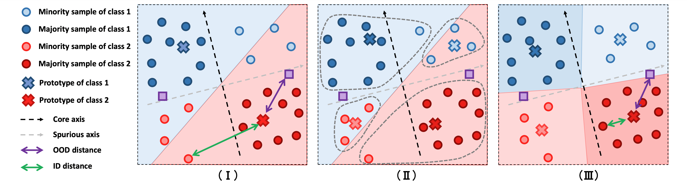

# SPROD: Spurious-Aware Prototype Refinement for Reliable OOD Detection

**Anonymous Authors**  
[NeurIPS 2025 Submission]

---

## Overview

**SPROD** is a post-hoc Out-of-Distribution (OOD) detection method designed to improve robustness against *unknown spurious correlations*. Unlike most OOD techniques that rely on auxiliary data or require fine-tuning, SPROD is a lightweight, plug-and-play solution compatible with any pretrained feature extractor.

SPROD refines class prototypes through a three-stage process that mitigates spurious biases in representations, enabling superior OOD detection in both binary and multi-class settings.

---

## 🔍 Key Features

- ✅ **Post-hoc & Training-Free** – Works with any frozen backbone — no need for fine-tuning or retraining.
- ✅ **Hyperparameter-Free** – No group annotations or validation data required.
- ✅ **Spurious-Aware** – Targets both SP-OOD and NSP-OOD samples.
- ✅ **Generalizable** – Evaluated across 5 diverse and challenging benchmarks.
- ✅ **State-of-the-Art** – Outperforms 11 leading post-hoc methods on AUROC and FPR@95.

---

## 📦 Codebase Structure

This codebase is **built upon [OpenOOD](https://github.com/Jingkang50/OpenOOD)**, an open benchmark for generalized OOD detection.

> 🔧 Our proposed method **SPROD** is implemented in the `sprod/` folder.

Please refer to the implementation there for full training and evaluation scripts.

---

## 🧠 Method: Spurious-Aware Prototype Refinement

SPROD improves OOD detection by iteratively refining class prototypes to account for subgroup biases:

1. **Initial Prototype Construction** – Average normalized features per class.
2. **Classification-Aware Grouping** – Separate samples based on classification correctness.
3. **Prototype Refinement** – Reassign to subgroup prototypes for improved bias handling.

Final OOD scores are computed using the minimum distance to any refined prototype.

---

## 📊 Datasets

SPROD is evaluated across 5 benchmarks with varying levels of spurious correlation:

| Dataset               | Type        | Spurious Attribute              | Classes |
|------------------------|-------------|----------------------------------|---------|
| **Waterbirds**         | Synthetic   | Background context               | 2       |
| **CelebA**             | Real-world  | Gender / Hair color              | 2       |
| **UrbanCars**          | Synthetic   | Background + co-occurring object| 2       |
| **Spurious ImageNet**  | Real-world  | Context-only features            | 100     |
| **Animals MetaCoCo**   | Real-world  | Background-based spurious bias  | 24      |

---

## 🖼️ SPROD Overview

  

> Illustration of SPROD’s three-stage prototype refinement pipeline.

---